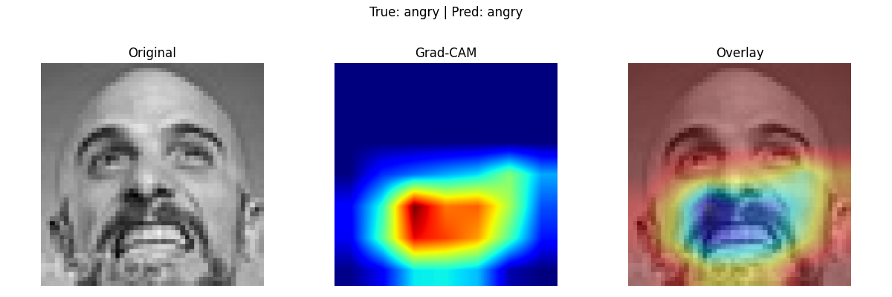

# Analysis and Conclusions

## Performance Comparison

| Model                          | Validation Accuracy | Notes                                                                    |
|--------------------------------|---------------------|--------------------------------------------------------------------------|
| **Custom CNN**                 | ~62%                | Solid baseline; easy to train end-to-end.                                 |
| **MobileNetV2 (no fine-tuning)**     | ~44%                | Underperformed “out of the box” on FER2013 without any adaptation.        |
| **MobileNetV2 (fine-tuned)**   | ~51%                | Fine-tuning the last 20 layers boosted val accuracy by ~7 points to ~51%. |

> **Exact post-fine-tune validation accuracy**: 50.8% (epoch 5).

---

## Grad-CAM Comparison

Below are example Grad-CAM visualizations for 5 validation samples from both models:

| Sample | Custom CNN                             | MobileNetV2 (Fine-Tuned)              |
|--------|----------------------------------------|---------------------------------------|
| 1      |  |  |
| 2      |  |  |
| 3      |  |   |
| 4      |  |  |
| 5      |  |  |

---

### Key Takeaways

1. **Accuracy Improvement**  
   Fine-tuning MobileNetV2 lifted validation accuracy from ~44% to ~51%, a substantial ~7 percentage-point gain in just 5 extra epochs.

2. **Sharper Attention Maps**  
   The fine-tuned model’s Grad-CAM overlays are noticeably more focused on core facial regions (eyes, brows, mouth) compared to both the custom CNN and the un-fine-tuned MobileNetV2, indicating better feature extraction.

3. **Model Trade-Offs**  
   - **Custom CNN**: Fast to train, fewer parameters, strong baseline at ~62%.  
   - **MobileNetV2 FT**: Larger model and longer training but, once fine-tuned, achieves ~51% and exhibits crisper attention maps—potentially more robust on new data.

---

## Next Steps

- **Further Fine-Tuning**: Unfreeze additional layers or train for a few more epochs to close the gap to the custom CNN.  
- **Data Augmentation**: Introduce brightness/sharpness jitter, random crops, or mixup to improve robustness.  
- **Additional Explainability**: Experiment with LIME or SHAP to complement Grad-CAM.  
- **Real-World Testing**: Validate models on an external emotion dataset to gauge generalization.

